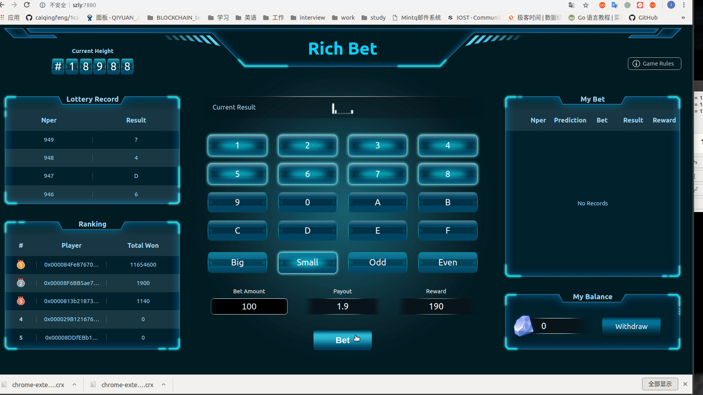
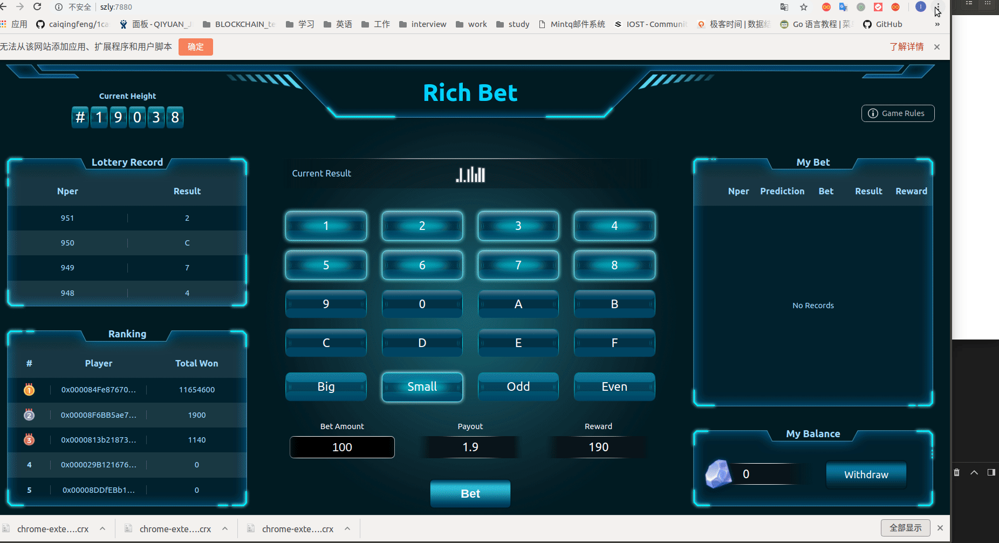
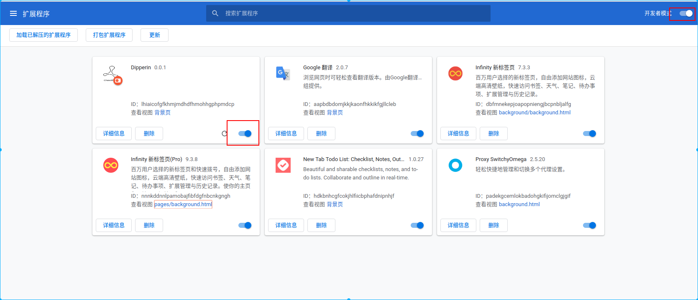
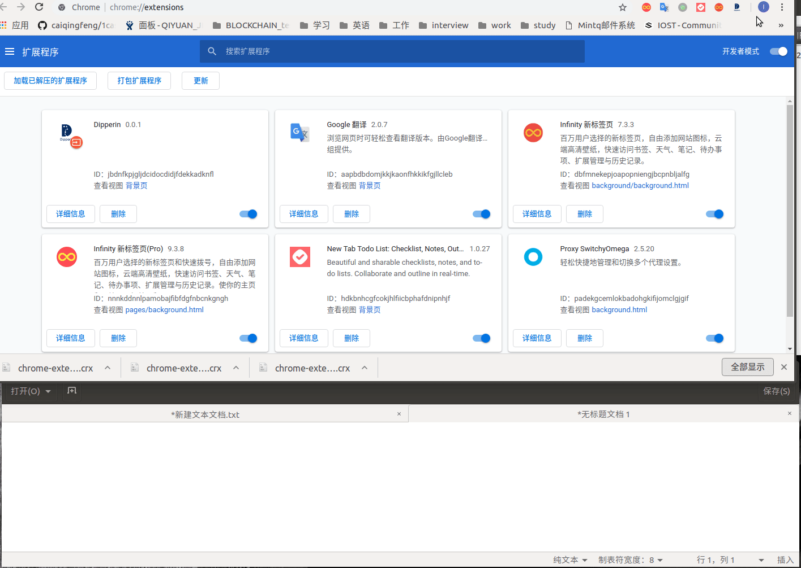
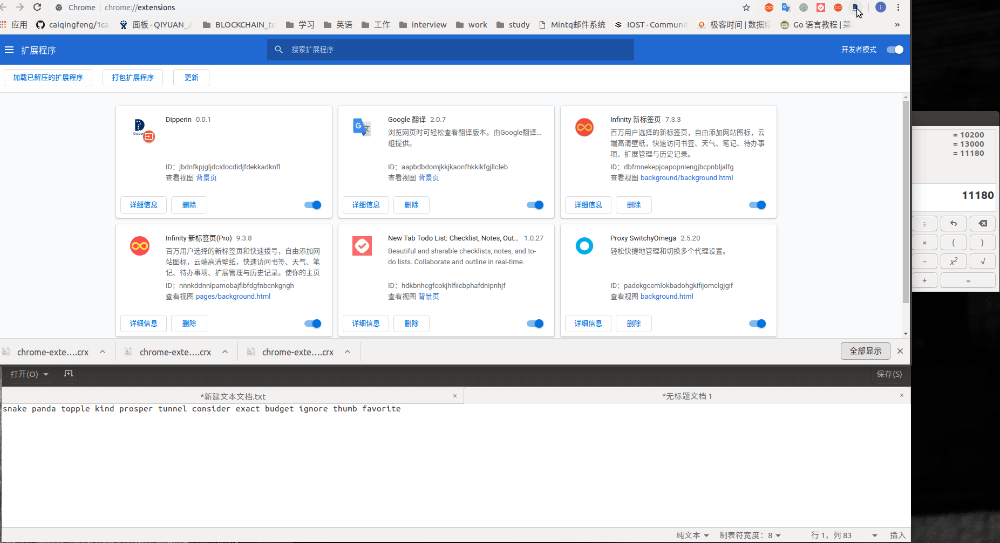
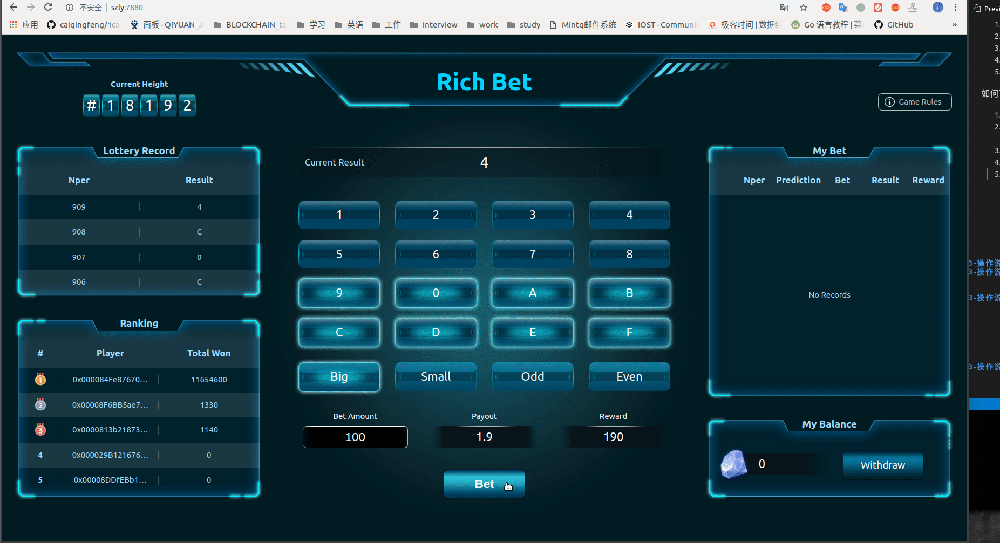
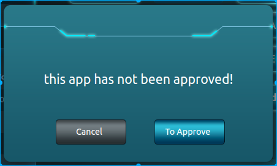

### 插件安装

1. 进入Dapp页面，点击Bet，点击Confirm，提示未下载插件（第一次使用者），点击下载链接下载插件  

2. 将下载好的文件直接拖动到浏览器的更多工具->扩展程序中，点击添加扩展程序  

3. 将图中的两个按钮打开  

### 插件的使用

1. 点击插件图标  
2. 点击Create Account（Import Accout是在已有钱包的情况下使用）  
3. 将助记词记录下来  
4. 根据上个页面的助记词顺序，选择正确的顺序的助记词  

5. 进入钱包  

### 如何下注（需要提前登录钱包）

1. 进入14.17.65.122:7880  
2. 选择要下的号码有20种选择，"Big"、"Small"、"Odd"、"Even"的赔率为1.9，其他的选择的赔率为15.6  
3. 点击Bet，并Confirm  

4. 弹出提示框，如图

，选择To Approve（第一次登录插件会有此效果）  
5. 弹出插件，点击confirm，插件弹窗关闭（第一次登录插件会有此效果）  
6. 再次点击提示框的confirm。再次弹出插件。点击confirm，下注成功  

